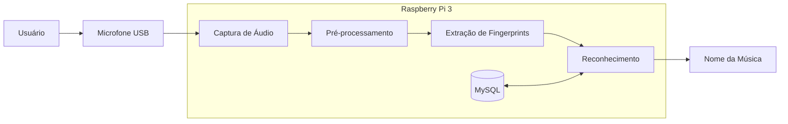

# Melody: Reconhecimento de Músicas utilizando Raspberry Pi 3

## Integrantes

- Ana Vitória Abreu Murad
- Andrey Rocha Reboredo 
- Yasmin Francisquetti Barnes

---

# Introdução

O reconhecimento automático de músicas é uma tecnologia amplamente utilizada em aplicações comerciais e plataformas digitais, permitindo identificar uma música a partir de pequenos trechos de áudio. Soluções como o Shazam demonstram que é possível reconhecer uma música em poucos segundos, mesmo quando o áudio é capturado por um microfone em ambientes com diferentes níveis de ruído.

Embora esses sistemas sejam bastante conhecidos, seu funcionamento envolve diversas áreas da Computação, como Processamento Digital de Sinais, Recuperação de Informação, Bancos de Dados e Sistemas Embarcados. Além disso, grande parte dessas soluções depende de infraestrutura em nuvem e grandes bases de dados centralizadas.

Neste projeto será desenvolvida uma versão simplificada desse tipo de sistema, executada inteiramente em uma Raspberry Pi 3. O dispositivo será responsável por capturar um trecho de áudio através de um microfone, extrair características relevantes desse sinal e compará-las com um banco de dados previamente construído, permitindo identificar músicas previamente cadastradas sem a necessidade de conexão com a internet.

O desenvolvimento deste projeto permitirá aplicar conceitos estudados ao longo da disciplina, envolvendo tanto aspectos de hardware quanto de software, além de proporcionar experiência prática no desenvolvimento de aplicações para plataformas embarcadas.

---

# Motivação

Nos últimos anos, dispositivos embarcados tornaram-se suficientemente capazes para executar algoritmos de processamento de sinais e aprendizado de máquina localmente. Isso possibilita o desenvolvimento de aplicações inteligentes sem depender constantemente de servidores remotos.

Neste contexto, um sistema de reconhecimento de músicas representa um excelente estudo de caso, pois envolve diferentes etapas de processamento de dados, desde a aquisição do sinal até a tomada de decisão final.

Além do aprendizado relacionado ao desenvolvimento para Raspberry Pi, o projeto permitirá compreender como sistemas de reconhecimento de padrões podem ser implementados utilizando técnicas eficientes de processamento de áudio. A proposta também incentiva a organização modular do software, o desenvolvimento incremental e a realização de testes experimentais para validação dos resultados obtidos.

---

# Objetivos

## Objetivo Geral

Desenvolver um sistema embarcado capaz de identificar músicas previamente cadastradas a partir de pequenos trechos de áudio capturados por um microfone conectado a uma Raspberry Pi 3.

## Objetivos Específicos

Para atingir esse objetivo geral, o projeto será dividido em etapas menores, permitindo a implementação e validação gradual de cada componente do sistema.

Os principais objetivos específicos são:

- Realizar a captura de áudio utilizando um microfone conectado à Raspberry Pi;
- Implementar o pré-processamento do sinal para reduzir interferências e padronizar os dados;
- Extrair fingerprints acústicos das músicas cadastradas;
- Armazenar essas informações em um banco de dados local;
- Comparar o trecho capturado com os fingerprints armazenados;
- Identificar a música correspondente;
- Apresentar ao usuário o resultado do reconhecimento;
- Avaliar a precisão, desempenho e tempo de resposta do sistema.

---

# Escopo do Projeto

O projeto será desenvolvido considerando um conjunto limitado de músicas previamente cadastradas em um banco de dados local. O objetivo não é competir com aplicações comerciais, mas compreender e implementar os principais conceitos envolvidos no reconhecimento automático de músicas.

Nesta primeira versão, o sistema será capaz de reconhecer apenas gravações originais presentes no banco de dados. A entrada será obtida através de um microfone conectado à Raspberry Pi enquanto uma música é reproduzida em outro dispositivo.

Não fazem parte do escopo desta versão funcionalidades como reconhecimento por letra da música, reconhecimento de voz humana cantando, identificação de pessoas cantarolando (humming), consulta em serviços online ou sincronização com bancos de dados externos.

---

# Funcionamento Geral do Sistema

O funcionamento do sistema será dividido em diferentes etapas.

Inicialmente, um trecho de aproximadamente oito segundos será capturado pelo microfone. Em seguida, o sinal de áudio passará por um processo de pré-processamento para normalização e preparação dos dados.

Posteriormente, serão extraídas características representativas do sinal, denominadas fingerprints acústicos. Essas informações serão comparadas com um banco de dados previamente construído contendo fingerprints de todas as músicas cadastradas.

Caso exista uma correspondência suficientemente forte entre o trecho capturado e alguma música do banco de dados, o sistema exibirá o título da música e, futuramente, também poderá apresentar o nome do artista e outras informações adicionais.

Caso contrário, o sistema informará que nenhuma música correspondente foi encontrada.

---

# Fundamento Teórico

O projeto baseia-se no conceito de **Acoustic Fingerprinting** (Impressão Digital Acústica), uma técnica que permite identificar trechos de áudio de forma rápida e robusta, mesmo na presença de ruído. O algoritmo central pode ser dividido em quatro etapas principais:

1. **Transformada Rápida de Fourier (FFT):** 
   O áudio bruto (no domínio do tempo) é dividido em pequenos segmentos e submetido a uma Transformada Rápida de Fourier. Esse processo converte o sinal para o domínio da frequência, gerando um espectrograma que mapeia as frequências e suas respectivas amplitudes ao longo do tempo.

2. **Extração de Picos (Mapa de Constelação):** 
   Em vez de analisar todo o espectrograma, o algoritmo divide o sinal em blocos ou zonas de tamanho fixo. Dentro de cada zona, ele identifica os pontos de pico de amplitude (as frequências de maior intensidade sonora). O resultado é uma representação esparsa do áudio, frequentemente chamada de Constellation Map (Mapa de Constelação), que descarta a maior parte do ruído e retém apenas as características mais marcantes da música.

3. **Geração de Hashes (Fingerprinting):** 
   Para tornar a busca eficiente e resistente a distorções (como cortes ou mudanças de alinhamento no tempo), os pontos de pico não são armazenados isoladamente. O algoritmo agrupa esses pontos — geralmente em pares estruturados (frequência do ponto A, frequência do ponto B e a diferença de tempo entre eles) — e aplica uma função de hash (como SHA-1). 

4. **Correspondência (Matching):** 
   A repetição desse processo por toda a música cria um conjunto único de milhares de hashes — a Fingerprint da música. Quando um novo sample de áudio precisa ser reconhecido, ele passa pelo mesmo processo e seus hashes são comparados contra um banco de dados, buscando o maior número de colisões alinhadas no tempo.

> **Implementações de Referência:** A lógica descrita acima é o coração de sistemas comerciais como o Shazam. Implementações open-source notáveis que utilizam exatamente essa abordagem em Python incluem as bibliotecas **Dejavu** e **audfprint**, que serviram como base conceitual para o desenvolvimento deste trabalho.

---

# Requisitos

A Tabela 1 apresenta os requisitos funcionais e não funcionais definidos para a primeira versão do sistema.

| ID | Tipo | Descrição | Caso de Teste |
|:---:|:---:|-----------|----------------|
| **RF01** | Funcional | O sistema deve capturar um trecho de áudio por meio de um microfone conectado à Raspberry Pi. | Conectar um microfone e verificar se um arquivo de áudio é gravado corretamente após iniciar a captura. |
| **RF02** | Funcional | O sistema deve manter um banco de dados local contendo as músicas previamente cadastradas. | Inserir uma nova música no banco de dados e verificar se ela fica disponível para reconhecimento. |
| **RF03** | Funcional | O sistema deve gerar fingerprints acústicos para cada música cadastrada. | Processar uma música do banco e verificar se seus fingerprints são gerados e armazenados corretamente. |
| **RF04** | Funcional | O sistema deve gerar fingerprints do trecho de áudio capturado pelo microfone. | Capturar um trecho de áudio e verificar se o algoritmo gera os fingerprints correspondentes. |
| **RF05** | Funcional | O sistema deve comparar os fingerprints capturados com aqueles armazenados no banco de dados. | Executar uma consulta utilizando um trecho de uma música cadastrada e verificar se ocorre correspondência. |
| **RF06** | Funcional | O sistema deve identificar e apresentar ao usuário o nome da música reconhecida. | Reproduzir uma música cadastrada e verificar se o sistema retorna corretamente seu título. |
| **RF07** | Funcional | O sistema deve informar quando nenhuma música compatível for encontrada. | Reproduzir uma música inexistente no banco de dados e verificar se o sistema informa que não houve correspondência. |
| **RNF01** | Não Funcional | O sistema deve operar integralmente de forma offline. | Desconectar a Raspberry Pi da internet e verificar o funcionamento normal do sistema. |
| **RNF02** | Não Funcional | O reconhecimento deverá ocorrer em até 10 segundos após a captura do áudio. | Medir o tempo entre o término da gravação e a apresentação do resultado. |
| **RNF03** | Não Funcional | O sistema deverá executar em uma Raspberry Pi 3 utilizando Raspberry Pi OS. | Implantar o software na Raspberry Pi e validar seu funcionamento. |
| **RNF04** | Não Funcional | O banco de dados deverá permitir a inclusão de novas músicas sem alterações no código-fonte. | Adicionar uma nova música ao banco e verificar seu reconhecimento. |
| **RNF05** | Não Funcional | O código deverá possuir organização modular, documentação e controle de versão. | Verificar a estrutura do projeto e do repositório GitHub. |

---

# Arquitetura Proposta

Para facilitar o desenvolvimento e manutenção do software, o sistema será dividido em módulos independentes.

Cada módulo será responsável por uma etapa específica do processamento, permitindo que cada componente seja desenvolvido, testado e validado separadamente antes da integração completa do sistema.

A comunicação entre esses módulos permitirá futuras melhorias sem necessidade de reestruturar completamente o sistema, tornando o projeto mais escalável.

---

# Tecnologias Utilizadas

O desenvolvimento será realizado utilizando a linguagem Python devido à ampla disponibilidade de bibliotecas voltadas ao processamento de sinais e ao desenvolvimento para Raspberry Pi.

Como plataforma de hardware será utilizada uma Raspberry Pi 3 equipada com um microfone USB para aquisição do sinal de áudio.

As principais tecnologias previstas são:

## Hardware

- Raspberry Pi 3
- Microfone USB
- Cartão MicroSD
- Fonte de alimentação

## Software

- Python 3
- Raspberry Pi OS
- MySQL
- MySQL Connector/Python
- Git
- GitHub

---

# Resultados Esperados

Ao término do projeto espera-se obter um sistema funcional capaz de reconhecer músicas previamente cadastradas utilizando apenas um pequeno trecho de áudio capturado pelo microfone.

Também espera-se compreender os principais conceitos envolvidos em sistemas de reconhecimento de padrões, processamento digital de sinais e desenvolvimento para plataformas embarcadas, consolidando os conhecimentos adquiridos ao longo da disciplina.

Além do funcionamento do sistema, serão avaliados indicadores como precisão do reconhecimento, tempo de resposta e facilidade de expansão do banco de dados.

---

# Próximos Passos

A primeira etapa prática do projeto consiste na configuração da Raspberry Pi e na implementação do módulo de captura de áudio.

Após validar o funcionamento do hardware, será desenvolvido o módulo responsável pelo pré-processamento do sinal. Em seguida, serão implementados os algoritmos de extração de fingerprints, armazenamento das informações em banco de dados e comparação entre o áudio capturado e as músicas cadastradas.

Por fim, todos os módulos serão integrados e submetidos a testes experimentais para avaliar a eficiência do sistema em diferentes condições de utilização.

---

# Licença

Este projeto possui finalidade exclusivamente acadêmica e está sendo desenvolvido como parte da disciplina PCS3732 - Laboratório de Processadores.
