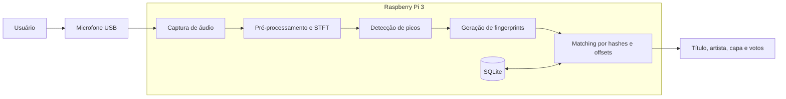

# Melody: Reconhecimento de Músicas utilizando Raspberry Pi 3

## Integrantes

- Ana Vitória Abreu Murad
- Andrey Rocha Reboredo
- Yasmin Francisquetti Barnes

## Relatório final

- [Código-fonte em LaTeX](docs/relatorio_final.tex)
- [Relatório compilado em PDF](docs/relatorio_final.pdf)

---

# Introdução

O reconhecimento automático de músicas é uma tecnologia amplamente utilizada em aplicações comerciais e plataformas digitais, permitindo identificar uma música a partir de pequenos trechos de áudio. Soluções como o Shazam demonstram que é possível reconhecer uma música em poucos segundos, mesmo quando o áudio é capturado por um microfone em ambientes com diferentes níveis de ruído.

Embora esses sistemas sejam bastante conhecidos, seu funcionamento envolve diversas áreas da Computação, como Processamento Digital de Sinais, Recuperação de Informação, Bancos de Dados e Sistemas Embarcados. Além disso, grande parte dessas soluções depende de infraestrutura em nuvem e grandes bases de dados centralizadas.

Neste projeto foi desenvolvida uma versão simplificada desse tipo de sistema, executada inteiramente em uma Raspberry Pi 3. O dispositivo captura um trecho de áudio através de um microfone, extrai características relevantes desse sinal e as compara com um banco de dados previamente construído, permitindo identificar músicas cadastradas sem conexão com a internet.

O desenvolvimento permitiu aplicar conceitos estudados ao longo da disciplina, envolvendo aspectos de hardware e software, além de proporcionar experiência prática com aplicações para plataformas embarcadas.

---

# Motivação

Nos últimos anos, dispositivos embarcados tornaram-se suficientemente capazes para executar algoritmos de processamento de sinais e aprendizado de máquina localmente. Isso possibilita o desenvolvimento de aplicações inteligentes sem depender constantemente de servidores remotos.

Neste contexto, um sistema de reconhecimento de músicas representa um excelente estudo de caso, pois envolve diferentes etapas de processamento de dados, desde a aquisição do sinal até a tomada de decisão final.

Além do aprendizado relacionado ao desenvolvimento para Raspberry Pi, o projeto permitiu compreender como sistemas de reconhecimento de padrões podem ser implementados utilizando técnicas eficientes de processamento de áudio. A organização modular do software, o desenvolvimento incremental e os testes experimentais também fizeram parte da validação dos resultados.

---

# Objetivos

## Objetivo Geral

Desenvolver um sistema embarcado capaz de identificar músicas previamente cadastradas a partir de pequenos trechos de áudio capturados por um microfone conectado a uma Raspberry Pi 3.

## Objetivos Específicos

O objetivo geral foi dividido em etapas menores, permitindo a implementação e a validação gradual de cada componente do sistema.

Os principais objetivos específicos são:

- Realizar a captura de áudio utilizando um microfone conectado à Raspberry Pi;
- Implementar o pré-processamento do sinal para reduzir interferências e padronizar os dados;
- Extrair fingerprints acústicos das músicas cadastradas;
- Armazenar essas informações em um banco de dados local;
- Comparar o trecho capturado com os fingerprints armazenados;
- Identificar a música correspondente;
- Apresentar ao usuário o resultado do reconhecimento;
- Avaliar a precisão, desempenho e tempo de resposta do sistema.

---

# Escopo do Projeto

O projeto considera um conjunto limitado de músicas previamente cadastradas em um banco de dados local. O objetivo não é competir com aplicações comerciais, mas compreender e implementar os principais conceitos envolvidos no reconhecimento automático de músicas.

Nesta primeira versão, o sistema reconhece a mesma gravação que foi cadastrada no banco de dados. A entrada é obtida através de um microfone conectado à Raspberry Pi enquanto uma música é reproduzida em outro dispositivo. Covers, canto, assobio e interpretações diferentes da mesma composição não fazem parte do escopo.

Não fazem parte do escopo desta versão funcionalidades como reconhecimento por letra da música, reconhecimento de voz humana cantando, identificação de pessoas cantarolando (humming), consulta em serviços online ou sincronização com bancos de dados externos.

---

# Funcionamento Geral do Sistema

O funcionamento do sistema é dividido em diferentes etapas.

Inicialmente, um trecho de oito segundos é capturado pelo microfone. Em seguida, o sinal passa por pré-processamento para normalização e preparação dos dados.

Posteriormente, são extraídas características representativas do sinal, denominadas fingerprints acústicos. Essas informações são comparadas com o banco local que contém os fingerprints das músicas cadastradas.

Quando há hashes alinhados, o sistema apresenta título, artista, capa quando disponível e quantidade de votos do melhor agrupamento temporal.

Quando não ocorre nenhuma colisão de hashes, o sistema informa que a música não foi identificada. A rejeição geral de áudio desconhecido ainda possui a limitação descrita ao final deste documento.

---

# Fundamento Teórico

O projeto baseia-se no conceito de **Acoustic Fingerprinting** (Impressão Digital Acústica), uma técnica que permite identificar trechos de áudio de forma rápida e robusta, mesmo na presença de ruído. O algoritmo central pode ser dividido em quatro etapas principais:

1. **Transformada de Fourier de Curto Termo (STFT):** 
   O áudio bruto, inicialmente no domínio do tempo, é dividido em janelas curtas e sobrepostas. Em cada janela é calculada uma Transformada Rápida de Fourier, produzindo um espectrograma que representa as frequências e suas amplitudes ao longo do tempo.

2. **Extração de Picos (Mapa de Constelação):** 
   Em vez de analisar todo o espectrograma, o algoritmo divide o sinal em blocos ou zonas de tamanho fixo. Dentro de cada zona, ele identifica os pontos de pico de amplitude (as frequências de maior intensidade sonora). O resultado é uma representação esparsa do áudio, frequentemente chamada de Constellation Map (Mapa de Constelação), que descarta a maior parte do ruído e retém apenas as características mais marcantes da música.

3. **Geração de Hashes (Fingerprinting):** 
   Para tornar a busca eficiente e resistente a distorções (como cortes ou mudanças de alinhamento no tempo), os pontos de pico não são armazenados isoladamente. O algoritmo agrupa esses pontos — geralmente em pares estruturados (frequência do ponto A, frequência do ponto B e a diferença de tempo entre eles) — e aplica uma função de hash (como SHA-1). 

4. **Correspondência (Matching):** 
   A repetição desse processo por toda a música cria um conjunto único de milhares de hashes — a Fingerprint da música. Quando um novo sample de áudio precisa ser reconhecido, ele passa pelo mesmo processo e seus hashes são comparados contra um banco de dados, buscando o maior número de colisões alinhadas no tempo.

> **Implementações de Referência:** A lógica descrita acima é o coração de sistemas comerciais como o Shazam. Implementações open-source notáveis que utilizam exatamente essa abordagem em Python incluem as bibliotecas **Dejavu** e **audfprint**, que serviram como base conceitual para o desenvolvimento deste trabalho.

---

# Requisitos

A Tabela 1 apresenta os requisitos funcionais e não funcionais definidos para a primeira versão do sistema.

| ID | Tipo | Descrição | Caso de Teste |
|:---:|:---:|-----------|----------------|
| **RF01** | Funcional | O sistema deve capturar um trecho de áudio por meio de um microfone conectado à Raspberry Pi. | Conectar um microfone e verificar se um arquivo de áudio é gravado corretamente após iniciar a captura. |
| **RF02** | Funcional | O sistema deve manter um banco de dados local contendo as músicas previamente cadastradas. | Inserir uma nova música no banco de dados e verificar se ela fica disponível para reconhecimento. |
| **RF03** | Funcional | O sistema deve gerar fingerprints acústicos para cada música cadastrada. | Processar uma música do banco e verificar se seus fingerprints são gerados e armazenados corretamente. |
| **RF04** | Funcional | O sistema deve gerar fingerprints do trecho de áudio capturado pelo microfone. | Capturar um trecho de áudio e verificar se o algoritmo gera os fingerprints correspondentes. |
| **RF05** | Funcional | O sistema deve comparar os fingerprints capturados com aqueles armazenados no banco de dados. | Executar uma consulta utilizando um trecho de uma música cadastrada e verificar se ocorre correspondência. |
| **RF06** | Funcional | O sistema deve identificar e apresentar ao usuário o nome da música reconhecida. | Reproduzir uma música cadastrada e verificar se o sistema retorna corretamente seu título. |
| **RF07** | Funcional | O sistema deve informar quando nenhuma música compatível for encontrada. | Reproduzir uma música inexistente no banco de dados e verificar se o sistema informa que não houve correspondência. |
| **RF08** | Funcional | O sistema deve disponibilizar uma interface física por meio de botões conectados aos pinos GPIO da Raspberry Pi. | Verificar se o botão azul inicia a gravação, o verde inicia o processamento e o vermelho interrompe imediatamente a execução. |
| **RNF01** | Não Funcional | O sistema deve operar integralmente de forma offline. | Desconectar a Raspberry Pi da internet e verificar o funcionamento normal do sistema. |
| **RNF02** | Não Funcional | O reconhecimento deverá ocorrer em até 10 segundos após a captura do áudio. | Medir o tempo entre o término da gravação e a apresentação do resultado. |
| **RNF03** | Não Funcional | O sistema deverá executar em uma Raspberry Pi 3 utilizando Raspberry Pi OS. | Implantar o software na Raspberry Pi e validar seu funcionamento. |
| **RNF04** | Não Funcional | O banco de dados deverá permitir a inclusão de novas músicas sem alterações no código-fonte. | Adicionar uma nova música ao banco e verificar seu reconhecimento. |
| **RNF05** | Não Funcional | O sistema deve possuir alta manutenabilidade, apresentando arquitetura modular, baixo acoplamento entre componentes e código devidamente documentado para facilitar diagnósticos, correções e evoluções de funcionalidades. | Análise estática do código para verificar coesão/acoplamento das classes e módulos, inspeção da documentação técnica (comentários/docstrings) e verificação do repositório do projeto. |

---

# Arquitetura

Para facilitar o desenvolvimento e a manutenção do software, o sistema foi dividido em módulos independentes. Cada módulo é responsável por uma etapa específica do processamento, permitindo testes isolados e integração gradual.



O fluxo de cadastro processa a música completa e armazena seus fingerprints no banco local. No fluxo de reconhecimento, um trecho de aproximadamente oito segundos é capturado pelo microfone, processado da mesma forma e comparado com os hashes cadastrados. Os matches são agrupados pelo identificador da música e pelo deslocamento temporal entre o trecho consultado e a gravação de referência.

---

# Tecnologias Utilizadas

O software foi desenvolvido em Python devido à ampla disponibilidade de bibliotecas voltadas ao processamento de sinais e ao desenvolvimento para Raspberry Pi.

Como plataforma de hardware foi utilizada uma Raspberry Pi 3 equipada com um microfone USB para aquisição do sinal de áudio.

As principais tecnologias utilizadas são:

## Hardware

- Raspberry Pi 3
- Microfone USB
- Cartão MicroSD
- Fonte de alimentação

## Software

- Python 3;
- Raspberry Pi OS;
- ALSA e `arecord` para captura de áudio;
- FFmpeg para conversão de MP3 para WAV mono em 16 kHz;
- NumPy;
- SciPy;
- Matplotlib;
- SQLite;
- Git;
- GitHub.

---

# Organização da Implementação

Os principais scripts implementados são:

| Script | Responsabilidade |
|---|---|
| `record.py` | Captura um trecho de áudio pelo microfone e o salva em WAV. |
| `generate_spectrogram.py` | Realiza o pré-processamento e gera o espectrograma por STFT. |
| `detect_peaks.py` | Detecta os picos espectrais e produz o mapa de constelação. |
| `generate_fingerprints.py` | Forma pares de landmarks e gera os hashes acústicos. |
| `load_fingerprints.py` | Insere fingerprints já processados no SQLite. |
| `match_song.py` | Consulta hashes, realiza votação por offset e apresenta o melhor resultado. |
| `add_song.py` | Automatiza conversão, processamento e cadastro de uma nova música. |
| `recognize.py` | Automatiza gravação, processamento da consulta e execução do matcher. |

## Cadastro de uma música

```bash
python src/add_song.py caminho/musica.mp3 \
    --title "Nome da música" \
    --artist "Nome do artista"
```

## Reconhecimento pelo microfone

```bash
python src/recognize.py \
    --device plughw:2,0 \
    --duration 8
```

## Testes automatizados

Os testes usam os arquivos WAV de referência e o banco de fingerprints já
existentes. Eles não acessam o microfone e não alteram os arquivos de consulta,
o banco de dados ou os gráficos do projeto.

Execute a suíte rápida a partir da pasta `song-recognizer`:

```bash
python -m unittest discover -s tests -v
```

A suíte verifica o reconhecimento das onze músicas, o pré-processamento de
silêncio, a repetibilidade do ruído sintético e o cancelamento imediato de um
subprocesso. O teste de rejeição de áudio desconhecido está marcado como falha
esperada enquanto o critério mínimo de aceitação de matches não for
implementado.

Para uma avaliação mais ampla, execute o benchmark:

```bash
python -m tests.benchmark_recognition
```

Por padrão, ele cria 99 casos: onze músicas, três posições por música e três
condições (`clean`, `noise` e `echo`). O comando também relata o comportamento
com ruído e tons sintéticos desconhecidos. Para fazer o benchmark encerrar com
erro quando houver falsos positivos nesses casos, use:

```bash
python -m tests.benchmark_recognition --strict-unknown
```

Resultados detalhados podem ser exportados sem alterar os artefatos de
produção:

```bash
python -m tests.benchmark_recognition \
    --json-output benchmark-results.json
```

---

# Resultados

O banco final contém **11 músicas** e **300.057 fingerprints**. A suíte rápida
executa seis testes: cinco são aprovados e um é mantido como falha esperada para
documentar a limitação de rejeição de áudio desconhecido.

O benchmark determinístico executa 99 casos de músicas cadastradas: onze
músicas, três posições por música e três condições de áudio. Todos os casos de
músicas cadastradas foram identificados corretamente.

| Condição | Corretos | Tempo médio no ambiente de desenvolvimento | Votos médios |
|---|---:|---:|---:|
| Limpo | 33/33 | 0,124 s | 942,1 |
| Ruído com SNR de 20 dB | 33/33 | 0,118 s | 716,5 |
| Eco sintético | 33/33 | 0,118 s | 481,2 |
| **Total** | **99/99** | — | — |

Esses trechos são derivados digitalmente das referências e, portanto, o
resultado não representa uma taxa de acerto universal para qualquer ambiente
acústico. Os tempos também não incluem a captura pelo microfone e não substituem
uma medição completa na Raspberry Pi.

## Testes manuais iniciais

Foram realizados testes de reconhecimento com trechos de aproximadamente oito segundos capturados durante a reprodução das músicas. As cinco músicas cadastradas foram identificadas corretamente.

| Música | Resultado | Votos alinhados | Offset estimado |
|---|:---:|---:|---:|
| I'm a Believer | Correto | 25 | 22,9 s |
| I Think We're Alone Now | Correto | 3 | 60,5 s |
| I Can See You | Correto | 31 | 167,9 s |
| Espresso | Correto | 19 | 20,1 s |
| One True Love | Correto | 3 | 30,7 s |

A taxa de acerto observada nesse conjunto inicial foi de **5/5 músicas identificadas corretamente**. Entretanto, a quantidade de votos variou de forma significativa. Em especial, `I Think We're Alone Now` e `One True Love` foram reconhecidas com apenas três votos alinhados, indicando menor margem de segurança diante de ruído, reverberação ou alterações na posição do microfone.

## Áudio desconhecido e versões diferentes

O benchmark também inclui ruído branco, tom de 440 Hz e acorde sintético. Os
três sinais produziram colisões esparsas de um ou dois votos e foram associados
incorretamente a músicas do banco. Isso demonstra que o matcher ainda precisa de
um limiar mínimo de aceitação.

Na apresentação final, também foram comparadas três gravações de
`I'm a Believer`: a gravação cadastrada, uma versão cover e uma interpretação de
outro artista. Apenas a gravação cadastrada foi reconhecida, comportamento
compatível com o escopo do projeto.

## Evidências em vídeo

- [Vídeo de reconhecimento de “I Think We're Alone Now”](https://drive.google.com/file/d/1WVeXX_BBBwl9FQLqkDflyXSvk02ixFJV/view?usp=drive_link)
- [Vídeo de reconhecimento de “I Can See You”](https://drive.google.com/file/d/1dMfCgbtVWppEejYeSiKkwlpFuSDm9pZl/view?usp=drive_link)
- [Demonstração comparativa de “I'm a Believer”: gravação cadastrada, cover e versão de outro artista](https://drive.google.com/drive/folders/1zcMDBFCq20FDo9gOkV1ytAR7sOgkPn05?usp=sharing)

---

## Interface visual

A interface foi prototipada no Figma e implementada em HTML, CSS e JavaScript. Ela possui uma página inicial com informações sobre o projeto e uma página de reconhecimento. O resultado apresenta título, artista, capa quando disponível e votos alinhados. Quando não existe capa, é exibido um quadro simples com uma nota musical.

Na interface e no GPIO, o azul inicia a gravação, o verde inicia o processamento e o vermelho interrompe imediatamente a execução. O botão amarelo permanece visível, mas não executa nenhuma ação. O [protótipo das telas está disponível no Google Drive](https://drive.google.com/drive/folders/1QI7yXe-QciUxqszAPm3iOHteYk10QRbw?usp=sharing).

---

# Situação final dos requisitos

| Requisito | Situação atual |
|---|---|
| RF01 — Captura pelo microfone | Implementado. |
| RF02 — Banco de dados local | Implementado. |
| RF03 — Fingerprints das músicas cadastradas | Implementado. |
| RF04 — Fingerprints do trecho capturado | Implementado. |
| RF05 — Comparação com o banco | Implementado por busca de hashes e votação de offsets. |
| RF06 — Apresentação da música reconhecida | Implementado com título, artista, capa e votos alinhados. |
| RF07 — Rejeição de música desconhecida | Parcialmente atendido: silêncio e versões musicais testadas são rejeitados, mas sinais sintéticos ainda podem gerar falsos positivos. |
| RF08 — Interface física por botões GPIO | Implementado com azul para gravar, verde para processar e vermelho para interromper. |
| RNF01 — Operação offline | Atendido pela arquitetura local. |
| RNF02 — Resultado em até 10 segundos após a captura | Inconclusivo: ainda falta uma medição sistemática da cadeia completa na Raspberry Pi 3. |
| RNF03 — Execução na Raspberry Pi 3 | Atendido e demonstrado no hardware durante a apresentação final. |
| RNF04 — Inclusão sem alterar código-fonte | Implementado pelo script `add_song.py`. |
| RNF05 — Modularidade, documentação e versionamento | Atendido qualitativamente por módulos separados, docstrings, testes automatizados e desenvolvimento incremental. |

---

# Limitações conhecidas

- O sistema reconhece gravações específicas cadastradas, não covers, canto, assobio ou outras interpretações da mesma composição.
- O critério de rejeição de áudio desconhecido ainda precisa de um limiar calibrado para evitar matches baseados em poucas colisões.
- O tempo completo entre o fim da captura e a apresentação do resultado ainda precisa ser medido sistematicamente na Raspberry Pi.
- Os 99 casos automatizados usam trechos digitais das referências e não substituem testes em diferentes salas, distâncias e posições do microfone.

---

# Licença

Este projeto possui finalidade exclusivamente acadêmica e foi desenvolvido como parte da disciplina PCS3732 - Laboratório de Processadores.
