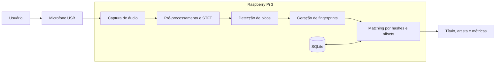

# Melody: Reconhecimento de Músicas utilizando Raspberry Pi 3

## Integrantes

- Ana Vitória Abreu Murad
- Andrey Rocha Reboredo 
- Yasmin Francisquetti Barnes

---

# Introdução

O reconhecimento automático de músicas é uma tecnologia amplamente utilizada em aplicações comerciais e plataformas digitais, permitindo identificar uma música a partir de pequenos trechos de áudio. Soluções como o Shazam demonstram que é possível reconhecer uma música em poucos segundos, mesmo quando o áudio é capturado por um microfone em ambientes com diferentes níveis de ruído.

Embora esses sistemas sejam bastante conhecidos, seu funcionamento envolve diversas áreas da Computação, como Processamento Digital de Sinais, Recuperação de Informação, Bancos de Dados e Sistemas Embarcados. Além disso, grande parte dessas soluções depende de infraestrutura em nuvem e grandes bases de dados centralizadas.

Neste projeto será desenvolvida uma versão simplificada desse tipo de sistema, executada inteiramente em uma Raspberry Pi 3. O dispositivo será responsável por capturar um trecho de áudio através de um microfone, extrair características relevantes desse sinal e compará-las com um banco de dados previamente construído, permitindo identificar músicas previamente cadastradas sem a necessidade de conexão com a internet.

O desenvolvimento deste projeto permitirá aplicar conceitos estudados ao longo da disciplina, envolvendo tanto aspectos de hardware quanto de software, além de proporcionar experiência prática no desenvolvimento de aplicações para plataformas embarcadas.

---

# Motivação

Nos últimos anos, dispositivos embarcados tornaram-se suficientemente capazes para executar algoritmos de processamento de sinais e aprendizado de máquina localmente. Isso possibilita o desenvolvimento de aplicações inteligentes sem depender constantemente de servidores remotos.

Neste contexto, um sistema de reconhecimento de músicas representa um excelente estudo de caso, pois envolve diferentes etapas de processamento de dados, desde a aquisição do sinal até a tomada de decisão final.

Além do aprendizado relacionado ao desenvolvimento para Raspberry Pi, o projeto permitirá compreender como sistemas de reconhecimento de padrões podem ser implementados utilizando técnicas eficientes de processamento de áudio. A proposta também incentiva a organização modular do software, o desenvolvimento incremental e a realização de testes experimentais para validação dos resultados obtidos.

---

# Objetivos

## Objetivo Geral

Desenvolver um sistema embarcado capaz de identificar músicas previamente cadastradas a partir de pequenos trechos de áudio capturados por um microfone conectado a uma Raspberry Pi 3.

## Objetivos Específicos

Para atingir esse objetivo geral, o projeto será dividido em etapas menores, permitindo a implementação e validação gradual de cada componente do sistema.

Os principais objetivos específicos são:

- Realizar a captura de áudio utilizando um microfone conectado à Raspberry Pi;
- Implementar o pré-processamento do sinal para reduzir interferências e padronizar os dados;
- Extrair fingerprints acústicos das músicas cadastradas;
- Armazenar essas informações em um banco de dados local;
- Comparar o trecho capturado com os fingerprints armazenados;
- Identificar a música correspondente;
- Apresentar ao usuário o resultado do reconhecimento;
- Avaliar a precisão, desempenho e tempo de resposta do sistema.

---

# Escopo do Projeto

O projeto será desenvolvido considerando um conjunto limitado de músicas previamente cadastradas em um banco de dados local. O objetivo não é competir com aplicações comerciais, mas compreender e implementar os principais conceitos envolvidos no reconhecimento automático de músicas.

Nesta primeira versão, o sistema será capaz de reconhecer apenas gravações originais presentes no banco de dados. A entrada será obtida através de um microfone conectado à Raspberry Pi enquanto uma música é reproduzida em outro dispositivo.

Não fazem parte do escopo desta versão funcionalidades como reconhecimento por letra da música, reconhecimento de voz humana cantando, identificação de pessoas cantarolando (humming), consulta em serviços online ou sincronização com bancos de dados externos.

---

# Funcionamento Geral do Sistema

O funcionamento do sistema será dividido em diferentes etapas.

Inicialmente, um trecho de aproximadamente oito segundos será capturado pelo microfone. Em seguida, o sinal de áudio passará por um processo de pré-processamento para normalização e preparação dos dados.

Posteriormente, serão extraídas características representativas do sinal, denominadas fingerprints acústicos. Essas informações serão comparadas com um banco de dados previamente construído contendo fingerprints de todas as músicas cadastradas.

Caso exista uma correspondência suficientemente forte entre o trecho capturado e alguma música do banco de dados, o sistema exibirá o título da música e, futuramente, também poderá apresentar o nome do artista e outras informações adicionais.

Caso contrário, o sistema informará que nenhuma música correspondente foi encontrada.

---

# Fundamento Teórico

O projeto baseia-se no conceito de **Acoustic Fingerprinting** (Impressão Digital Acústica), uma técnica que permite identificar trechos de áudio de forma rápida e robusta, mesmo na presença de ruído. O algoritmo central pode ser dividido em quatro etapas principais:

1. **Transformada de Fourier de Curto Termo (STFT):** 
   O áudio bruto, inicialmente no domínio do tempo, é dividido em janelas curtas e sobrepostas. Em cada janela é calculada uma Transformada Rápida de Fourier, produzindo um espectrograma que representa as frequências e suas amplitudes ao longo do tempo.

2. **Extração de Picos (Mapa de Constelação):** 
   Em vez de analisar todo o espectrograma, o algoritmo divide o sinal em blocos ou zonas de tamanho fixo. Dentro de cada zona, ele identifica os pontos de pico de amplitude (as frequências de maior intensidade sonora). O resultado é uma representação esparsa do áudio, frequentemente chamada de Constellation Map (Mapa de Constelação), que descarta a maior parte do ruído e retém apenas as características mais marcantes da música.

3. **Geração de Hashes (Fingerprinting):** 
   Para tornar a busca eficiente e resistente a distorções (como cortes ou mudanças de alinhamento no tempo), os pontos de pico não são armazenados isoladamente. O algoritmo agrupa esses pontos — geralmente em pares estruturados (frequência do ponto A, frequência do ponto B e a diferença de tempo entre eles) — e aplica uma função de hash (como SHA-1). 

4. **Correspondência (Matching):** 
   A repetição desse processo por toda a música cria um conjunto único de milhares de hashes — a Fingerprint da música. Quando um novo sample de áudio precisa ser reconhecido, ele passa pelo mesmo processo e seus hashes são comparados contra um banco de dados, buscando o maior número de colisões alinhadas no tempo.

> **Implementações de Referência:** A lógica descrita acima é o coração de sistemas comerciais como o Shazam. Implementações open-source notáveis que utilizam exatamente essa abordagem em Python incluem as bibliotecas **Dejavu** e **audfprint**, que serviram como base conceitual para o desenvolvimento deste trabalho.

---

# Requisitos

A Tabela 1 apresenta os requisitos funcionais e não funcionais definidos para a primeira versão do sistema.

| ID | Tipo | Descrição | Caso de Teste |
|:---:|:---:|-----------|----------------|
| **RF01** | Funcional | O sistema deve capturar um trecho de áudio por meio de um microfone conectado à Raspberry Pi. | Conectar um microfone e verificar se um arquivo de áudio é gravado corretamente após iniciar a captura. |
| **RF02** | Funcional | O sistema deve manter um banco de dados local contendo as músicas previamente cadastradas. | Inserir uma nova música no banco de dados e verificar se ela fica disponível para reconhecimento. |
| **RF03** | Funcional | O sistema deve gerar fingerprints acústicos para cada música cadastrada. | Processar uma música do banco e verificar se seus fingerprints são gerados e armazenados corretamente. |
| **RF04** | Funcional | O sistema deve gerar fingerprints do trecho de áudio capturado pelo microfone. | Capturar um trecho de áudio e verificar se o algoritmo gera os fingerprints correspondentes. |
| **RF05** | Funcional | O sistema deve comparar os fingerprints capturados com aqueles armazenados no banco de dados. | Executar uma consulta utilizando um trecho de uma música cadastrada e verificar se ocorre correspondência. |
| **RF06** | Funcional | O sistema deve identificar e apresentar ao usuário o nome da música reconhecida. | Reproduzir uma música cadastrada e verificar se o sistema retorna corretamente seu título. |
| **RF07** | Funcional | O sistema deve informar quando nenhuma música compatível for encontrada. | Reproduzir uma música inexistente no banco de dados e verificar se o sistema informa que não houve correspondência. |
| **RF08** | Funcional | O sistema deve disponibilizar uma interface física por meio de botões conectados aos pinos GPIO da Raspberry Pi. | Pressionar o botão de reconhecimento e verificar se o sistema inicia a gravação, processa o trecho e apresenta o resultado automaticamente. |
| **RNF01** | Não Funcional | O sistema deve operar integralmente de forma offline. | Desconectar a Raspberry Pi da internet e verificar o funcionamento normal do sistema. |
| **RNF02** | Não Funcional | O reconhecimento deverá ocorrer em até 10 segundos após a captura do áudio. | Medir o tempo entre o término da gravação e a apresentação do resultado. |
| **RNF03** | Não Funcional | O sistema deverá executar em uma Raspberry Pi 3 utilizando Raspberry Pi OS. | Implantar o software na Raspberry Pi e validar seu funcionamento. |
| **RNF04** | Não Funcional | O banco de dados deverá permitir a inclusão de novas músicas sem alterações no código-fonte. | Adicionar uma nova música ao banco e verificar seu reconhecimento. |
| **RNF05** | Não Funcional | O sistema deve possuir alta manutenabilidade, apresentando arquitetura modular, baixo acoplamento entre componentes e código devidamente documentado para facilitar diagnósticos, correções e evoluções de funcionalidades. | Análise estática do código para verificar coesão/acoplamento das classes e módulos, inspeção da documentação técnica (comentários/docstrings) e verificação do repositório do projeto. |

---

# Arquitetura Proposta

Para facilitar o desenvolvimento e a manutenção do software, o sistema foi dividido em módulos independentes. Cada módulo é responsável por uma etapa específica do processamento, permitindo testes isolados e integração gradual.



O fluxo de cadastro processa a música completa e armazena seus fingerprints no banco local. No fluxo de reconhecimento, um trecho de aproximadamente oito segundos é capturado pelo microfone, processado da mesma forma e comparado com os hashes cadastrados. Os matches são agrupados pelo identificador da música e pelo deslocamento temporal entre o trecho consultado e a gravação de referência.

---

# Tecnologias Utilizadas

O desenvolvimento será realizado utilizando a linguagem Python devido à ampla disponibilidade de bibliotecas voltadas ao processamento de sinais e ao desenvolvimento para Raspberry Pi.

Como plataforma de hardware será utilizada uma Raspberry Pi 3 equipada com um microfone USB para aquisição do sinal de áudio.

As principais tecnologias previstas são:

## Hardware

- Raspberry Pi 3
- Microfone USB
- Cartão MicroSD
- Fonte de alimentação

## Software

- Python 3;
- Raspberry Pi OS;
- ALSA e `arecord` para captura de áudio;
- FFmpeg para conversão de MP3 para WAV mono em 16 kHz;
- NumPy;
- SciPy;
- Matplotlib;
- SQLite;
- Git;
- GitHub.

---

# Organização da Implementação

Os principais scripts implementados são:

| Script | Responsabilidade |
|---|---|
| `record.py` | Captura um trecho de áudio pelo microfone e o salva em WAV. |
| `generate_spectrogram.py` | Realiza o pré-processamento e gera o espectrograma por STFT. |
| `detect_peaks.py` | Detecta os picos espectrais e produz o mapa de constelação. |
| `generate_fingerprints.py` | Forma pares de landmarks e gera os hashes acústicos. |
| `load_fingerprints.py` | Insere fingerprints já processados no SQLite. |
| `match_song.py` | Consulta hashes, realiza votação por offset e apresenta o melhor resultado. |
| `add_song.py` | Automatiza conversão, processamento e cadastro de uma nova música. |
| `recognize.py` | Automatiza gravação, processamento da consulta e execução do matcher. |

## Cadastro de uma música

```bash
python src/add_song.py caminho/musica.mp3 \
    --title "Nome da música" \
    --artist "Nome do artista"
```

## Reconhecimento pelo microfone

```bash
python src/recognize.py \
    --device plughw:2,0 \
    --duration 8
```

---

# Resultados dos Testes Iniciais

Foram realizados testes de reconhecimento com trechos de aproximadamente oito segundos capturados durante a reprodução das músicas. As cinco músicas cadastradas foram identificadas corretamente.

| Música | Resultado | Votos alinhados | Offset estimado | Confiança exibida |
|---|:---:|---:|---:|---:|
| I'm a Believer | Correto | 25 | 22,9 s | 35,7% |
| I Think We're Alone Now | Correto | 3 | 60,5 s | 12,0% |
| I Can See You | Correto | 31 | 167,9 s | 29,5% |
| Espresso | Correto | 19 | 20,1 s | 78,0% |
| One True Love | Correto | 3 | 30,7 s | 3,2% |

A taxa de acerto observada nesse conjunto inicial foi de **5/5 músicas identificadas corretamente**. Entretanto, os valores de votos e confiança variaram de forma significativa. Em especial, `I Think We're Alone Now` e `One True Love` foram reconhecidas com apenas três votos alinhados, indicando menor margem de segurança diante de ruído, reverberação ou alterações na posição do microfone.

A métrica de confiança exibida pelo protótipo é calculada a partir da relação entre os votos do melhor agrupamento temporal e o total de ocorrências de hashes encontradas. Portanto, ela funciona como um indicador comparativo interno e **não deve ser interpretada como uma probabilidade estatística calibrada de acerto**.

## Evidências em vídeo

- [Vídeo de reconhecimento de “I Think We're Alone Now”](https://drive.google.com/file/d/1WVeXX_BBBwl9FQLqkDflyXSvk02ixFJV/view?usp=drive_link)
- [Vídeo de reconhecimento de “I Can See You”](https://drive.google.com/file/d/1dMfCgbtVWppEejYeSiKkwlpFuSDm9pZl/view?usp=drive_link)

---

## Interface Visual

Nas últimas duas semanas de projeto, foi implementada a interface visual do projeto. A prototipação foi feita através da ferramenta Figma e em seguida implementada em HTML, .css e JavaScript. Foram feitas duas telas, uma como inicial, com informações sobre o projeto e a outra com a implementação da funcionalidade de reconhecimento musical. O protótipo das telas pode ser encontrado [nesse link](https://drive.google.com/drive/folders/1QI7yXe-QciUxqszAPm3iOHteYk10QRbw?usp=sharing).

## Evidências em vídeo

- [Vídeo de reconhecimento na interface visual de "Faint”](https://drive.google.com/file/d/1rLpTn6fKmtMdpTGRO0p9CcuUjlkBJj4Z/view?usp=sharing)
- [Vídeo de reconhecimento na interface visual de “I'm a Believer”](https://drive.google.com/file/d/1J5bIVzYEBFFINbpdiOmMa_muk8vZdySW/view?usp=sharing)

---

---

# Situação Atual dos Requisitos

| Requisito | Situação atual |
|---|---|
| RF01 — Captura pelo microfone | Implementado. |
| RF02 — Banco de dados local | Implementado. |
| RF03 — Fingerprints das músicas cadastradas | Implementado. |
| RF04 — Fingerprints do trecho capturado | Implementado. |
| RF05 — Comparação com o banco | Implementado por busca de hashes e votação de offsets. |
| RF06 — Apresentação da música reconhecida | Implementado com título, artista e métricas. |
| RF07 — Rejeição de música desconhecida | Não Implementado |
| RF08 — Interface física por botões GPIO | Planejado. |
| RNF01 — Operação offline | Atendido pela arquitetura local. |
| RNF02 — Resultado em até 10 segundos após a captura | Pendente de medição sistemática na Raspberry Pi 3. |
| RNF03 — Execução na Raspberry Pi 3 | Pendente de validação final integrada no hardware. |
| RNF04 — Inclusão sem alterar código-fonte | Implementado pelo script `add_song.py`. |
| RNF05 — Modularidade, documentação e versionamento | Em andamento, com atualização para a segunda release. |

---

# Próximos Passos

1. Ajustes finais;
2. Testes automatizados.

---

# Licença

Este projeto possui finalidade exclusivamente acadêmica e está sendo desenvolvido como parte da disciplina PCS3732 - Laboratório de Processadores.
